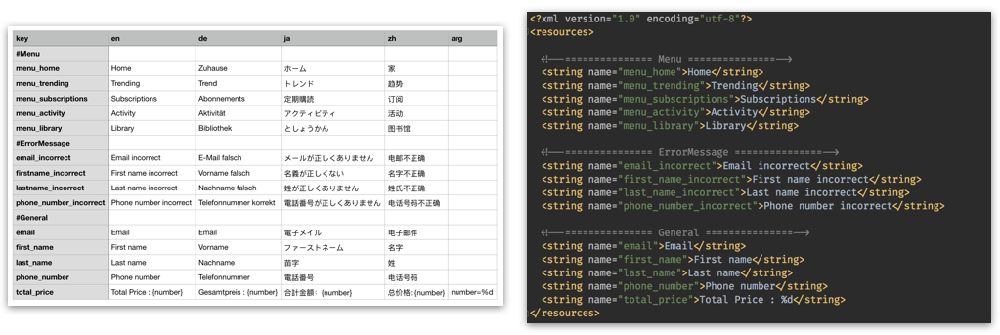
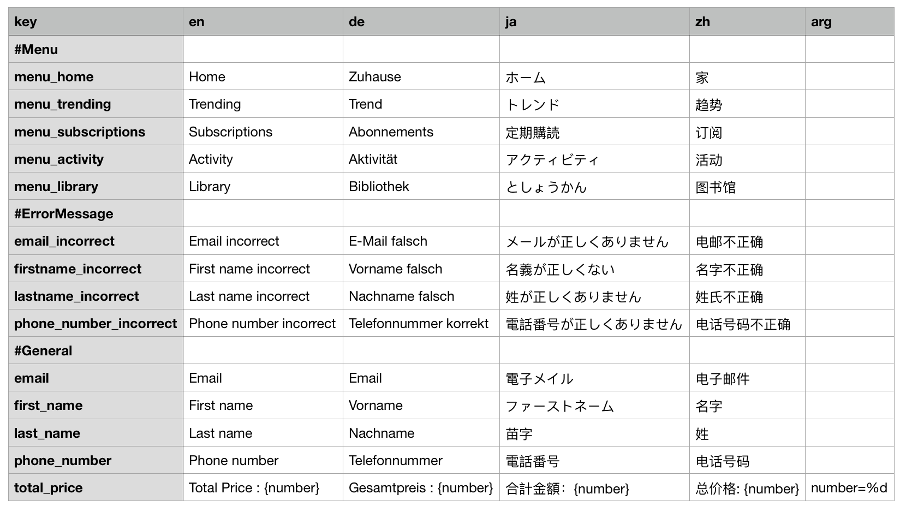

# csv2string-xml-android 
Python scripts converting csv file to Android strings.xml resources multiple language 🌈

Requirements
------------

To satisfy requirements, run the following command:

`$ pip install lxml`

If you are not using pip in a virtualenv and want to install lxml globally instead, you have to run the above command as admin, e.g. on Linux:

`$ sudo  pip install lxml`

CSV Syntax
----

* First line must have minimum 2 column [key | language-code]
* Add `#` before string for comment message in strings.xml
* Column `arg` is optional but if you provide it. It must be at last column
* You can add multi column language code 

[file csv example](./csv-example.csv)

Usage
-----
1. Open Terminal  :joy:

2. Export path in your `.bash_profile` or `.zshrc` 

    `export PATH=$HOME/directory_your_download_this_project/csv2string-xml-android/bin:$PATH`

3. Go to your directory Android Project
    
    `cd AndroidStudio/project_name`

4. Generating *.xml files multi language
    
    `csv2xml`
    
    Continue enter your path file csv in terminal
    
    `Path to CSV file : path-file-csv/csv-example.csv`
    
    
Output
-----    
    ...
    app
    └── src
        └── main
            └── res
                ├── values
                │   └── strings.xml
                └── values-de
                │   └── strings.xml
                └── values-ja
                │   └── strings.xml
                └── values-zh
                    └── strings.xml

Reference
-----
 - [x] android-resource-converter by pwittchen [link](https://github.com/pwittchen/android-resource-converter)
 
 
License
-----

    Copyright 2017 Jedsada Tiwongvorakul

    Licensed under the Apache License, Version 2.0 (the "License");
    you may not use this file except in compliance with the License.
    You may obtain a copy of the License at

    http://www.apache.org/licenses/LICENSE-2.0

    Unless required by applicable law or agreed to in writing, software
    distributed under the License is distributed on an "AS IS" BASIS,
    WITHOUT WARRANTIES OR CONDITIONS OF ANY KIND, either express or implied.
    See the License for the specific language governing permissions and
    limitations under the License.
