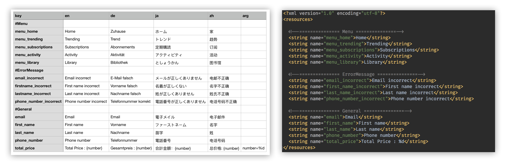

# csv2string-xml-android [](https://travis-ci.org/T-Jedsada/csv2string-xml-android)
Python scripts converting csv file to Android strings.xml resources multiple language 🌈



Requirements
------------

To satisfy requirements, run the following command:

`$ pip install lxml`

If you are not using pip in a virtualenv and want to install lxml globally instead, you have to run the above command as admin, e.g. on Linux:

`$ sudo  pip install lxml`

CSV Syntax
----


* First line must have minimum 2 column [key | language-code]
* Add `#` before string for comment message in strings.xml
* Column `arg` is optional but if you provide it. It must be at last column
* You can add multi column language code 

[file csv example](./csv-example.csv)

Usage
-----
1. Open Terminal  :joy:

2. Export path in your `.bash_profile` or `.zshrc` 

    `export PATH=$HOME/directory_your_download_this_project/csv2string-xml-android/bin:$PATH`

3. Go to your directory Android Project
    
    `cd AndroidStudio/project_name`

4. Generating *.xml files multi language
    
    `csv2xml`
    
    Continue enter your path file csv in terminal
    
    `Path to CSV file : path-file-csv/csv-example.csv`
    
    
Output
-----    
    ...
    app
    └── src
        └── main
            └── res
                ├── values
                │   └── strings.xml
                └── values-de
                │   └── strings.xml
                └── values-ja
                │   └── strings.xml
                └── values-zh
                    └── strings.xml

Reference
-----
 - [x] android-resource-converter by pwittchen [link](https://github.com/pwittchen/android-resource-converter)
 
 
License
-----

```
Copyright (c) 2017 Jedsada Tiwongvorakul

Permission is hereby granted, free of charge, to any person obtaining a copy
of this software and associated documentation files (the "Software"), to deal
in the Software without restriction, including without limitation the rights
to use, copy, modify, merge, publish, distribute, sublicense, and/or sell
copies of the Software, and to permit persons to whom the Software is
furnished to do so, subject to the following conditions:

The above copyright notice and this permission notice shall be included in all
copies or substantial portions of the Software.

THE SOFTWARE IS PROVIDED "AS IS", WITHOUT WARRANTY OF ANY KIND, EXPRESS OR
IMPLIED, INCLUDING BUT NOT LIMITED TO THE WARRANTIES OF MERCHANTABILITY,
FITNESS FOR A PARTICULAR PURPOSE AND NONINFRINGEMENT. IN NO EVENT SHALL THE
AUTHORS OR COPYRIGHT HOLDERS BE LIABLE FOR ANY CLAIM, DAMAGES OR OTHER
LIABILITY, WHETHER IN AN ACTION OF CONTRACT, TORT OR OTHERWISE, ARISING FROM,
OUT OF OR IN CONNECTION WITH THE SOFTWARE OR THE USE OR OTHER DEALINGS IN THE
SOFTWARE.
```
